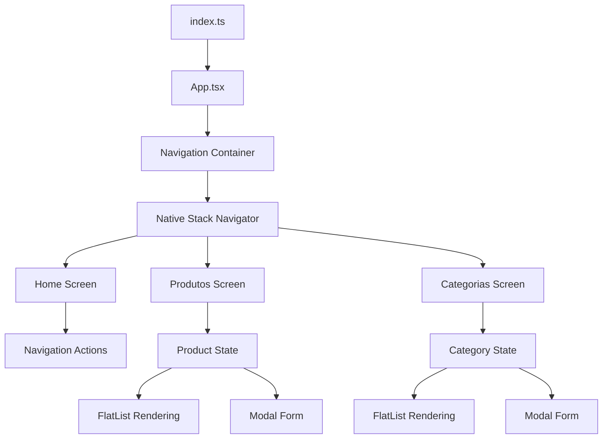
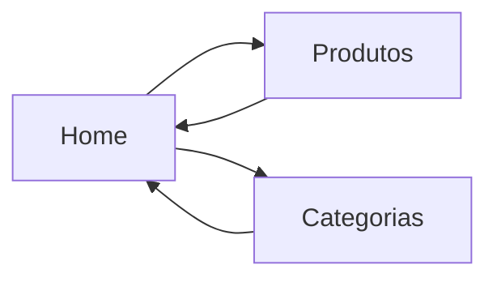
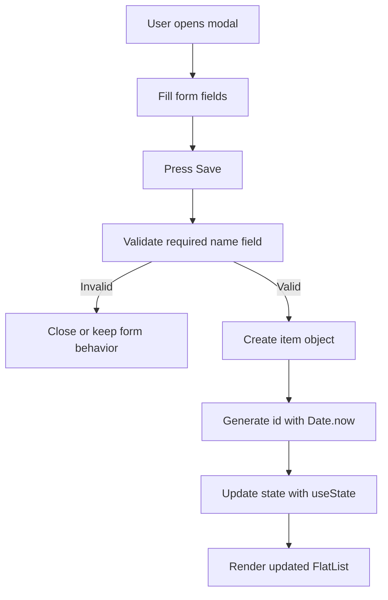
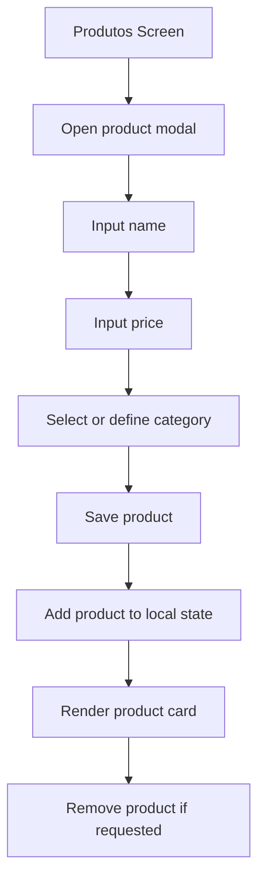
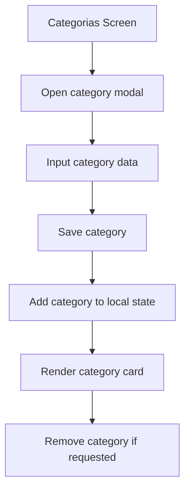
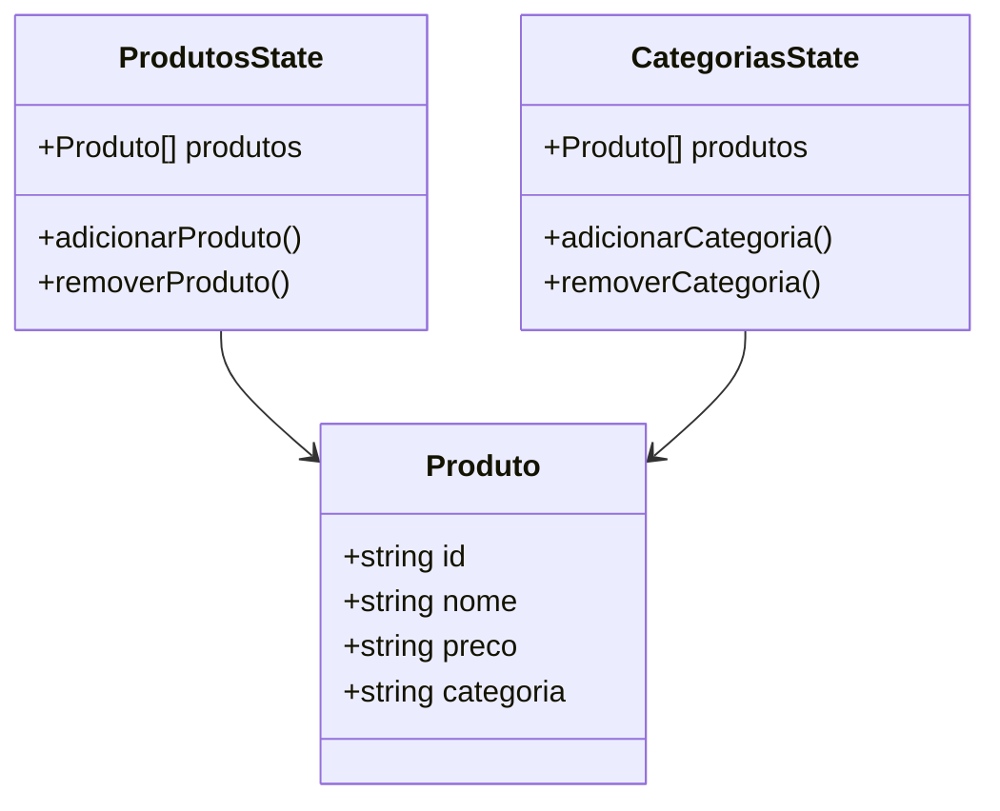
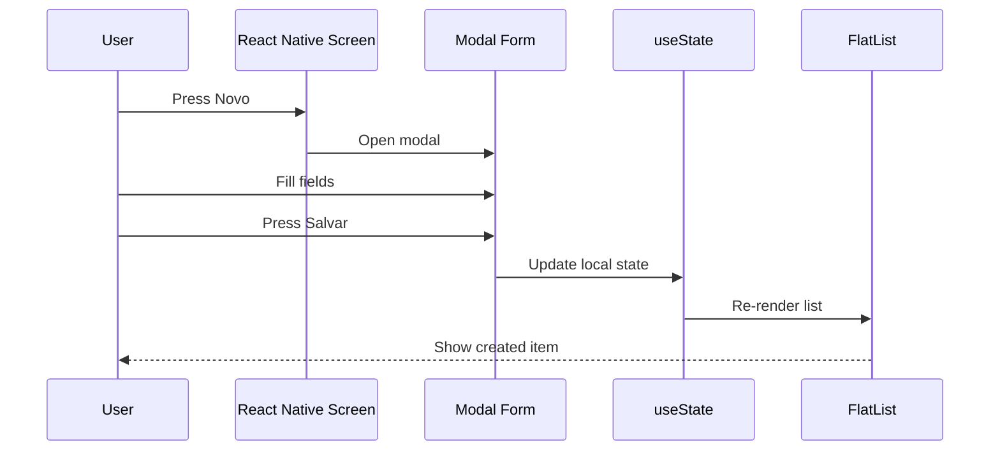
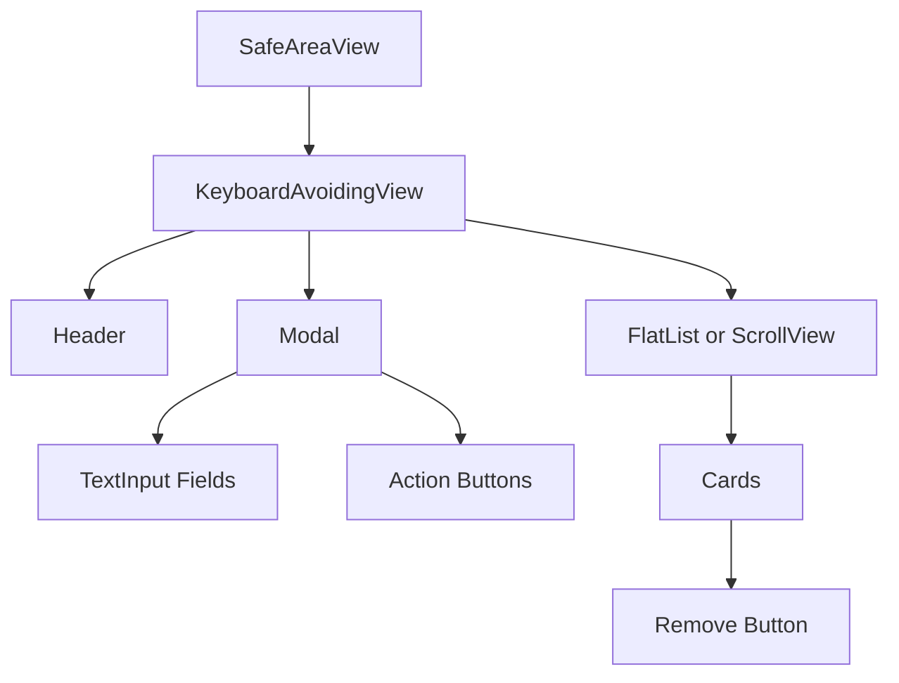
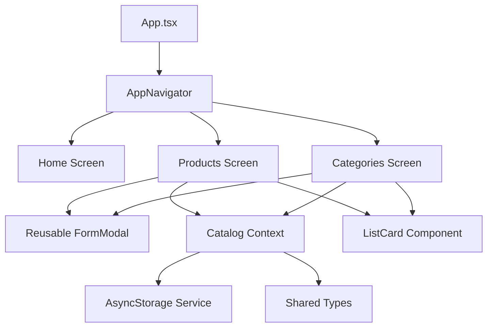
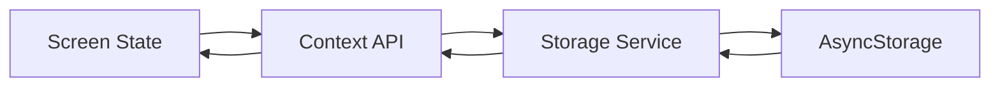

# Expo React Native TypeScript Catalog CRUD App

<p align="center">
  
  
  
  
  
  
</p>

## Overview

Aplicativo mobile desenvolvido com Expo, React Native e TypeScript para gerenciamento local de produtos e categorias.

O projeto implementa uma interface simples de catálogo, permitindo navegar entre telas, cadastrar itens por meio de formulários em modal, listar registros com `FlatList` e remover itens da lista. Os dados são controlados em memória utilizando `useState`, sem integração com banco de dados externo.

## Technical Scope

| Área | Aplicação |
|---|---|
| Runtime mobile | Expo |
| Framework de interface | React Native |
| Linguagem | TypeScript |
| Navegação | React Navigation Native Stack |
| Gerenciamento de estado | `useState` |
| Listagem | `FlatList` |
| Entrada de dados | `TextInput` |
| Interface modal | `Modal` |
| Estilização | `StyleSheet` |
| Persistência | Estado local em memória |
| Plataformas | Android, iOS e Web via Expo |

## Repository Structure

```text
expo-react-native-typescript-catalog-crud-app/
├── assets/
├── docs/
│   ├── 1.png
│   ├── 2.png
│   └── 3.png
├── src/
│   └── screens/
│       ├── Categorias/
│       │   └── Categorias.tsx
│       ├── Home/
│       │   └── Home.tsx
│       └── Produtos/
│           └── Produtos.tsx
├── App.tsx
├── app.json
├── index.ts
├── package.json
├── package-lock.json
├── tsconfig.json
└── README.md
```

## Application Architecture



## Screen Map

| Tela | Arquivo | Responsabilidade |
|---|---|---|
| Home | `src/screens/Home/Home.tsx` | Tela inicial com navegação para produtos e categorias |
| Produtos | `src/screens/Produtos/Produtos.tsx` | Cadastro, listagem e remoção de produtos |
| Categorias | `src/screens/Categorias/Categorias.tsx` | Cadastro, listagem e remoção de categorias |
| App | `App.tsx` | Configuração principal de navegação |
| Entry Point | `index.ts` | Registro do componente raiz com Expo |

## Main Features

| Recurso | Descrição |
|---|---|
| Stack navigation | Navegação entre Home, Produtos e Categorias |
| Product registration | Cadastro local de produtos com nome, preço e categoria |
| Category registration | Cadastro local de categorias |
| Modal forms | Formulários exibidos em modal inferior |
| Dynamic listing | Renderização dos registros com `FlatList` |
| Empty state | Mensagem quando não há registros cadastrados |
| Remove action | Remoção de itens diretamente pela lista |
| Local state | Dados armazenados temporariamente com `useState` |
| Mobile layout | Interface otimizada para telas mobile |

## Navigation Flow



## Data Flow



## Product Management Flow



## Category Management Flow



## Component Responsibility

| Componente / API | Uso no projeto |
|---|---|
| `SafeAreaView` | Mantém a interface dentro da área segura do dispositivo |
| `KeyboardAvoidingView` | Ajusta o layout quando o teclado é aberto |
| `ScrollView` | Organiza conteúdo rolável na tela inicial |
| `FlatList` | Renderiza listas de produtos e categorias |
| `Modal` | Exibe formulários para cadastro |
| `TextInput` | Captura dados digitados pelo usuário |
| `Pressable` | Cria botões interativos |
| `StyleSheet` | Centraliza os estilos da interface |
| `StatusBar` | Controla a barra de status do Expo |

## State Management

O projeto utiliza `useState` para controlar os dados da interface.

```typescript
const [modalVisible, setModalVisible] = useState(false);
const [nome, setNome] = useState("");
const [preco, setPreco] = useState("");
const [categoria, setCategoria] = useState("");
const [produtos, setProdutos] = useState([]);
```

## Local CRUD Operations

| Operação | Implementação |
|---|---|
| Create | Adiciona um novo item ao array em memória |
| Read | Renderiza os itens com `FlatList` |
| Update | Não implementado no estado atual |
| Delete | Remove o item filtrando pelo `id` |
| Persistence | Temporária, perdida ao reiniciar o app |

## Product Data Model

```typescript
type Produto = {
  id: string;
  nome: string;
  preco: string;
  categoria: string;
};
```

## In-Memory Data Model



## User Interface Flow



## Main Dependencies

| Dependência | Finalidade |
|---|---|
| `expo` | Runtime e tooling para desenvolvimento mobile |
| `react` | Construção da interface baseada em componentes |
| `react-native` | Componentes nativos para Android, iOS e Web |
| `@react-navigation/native` | Base de navegação entre telas |
| `@react-navigation/native-stack` | Stack Navigator nativo |
| `react-native-screens` | Otimização de telas nativas |
| `react-native-safe-area-context` | Controle de áreas seguras |
| `react-native-gesture-handler` | Suporte a gestos nativos |
| `react-native-reanimated` | Suporte a animações e gestos avançados |
| `expo-status-bar` | Controle da barra de status |
| `typescript` | Tipagem estática no projeto |

## Available Scripts

| Script | Comando | Descrição |
|---|---|---|
| Start | `npm start` | Inicia o Expo Dev Server |
| Android | `npm run android` | Executa o projeto no Android |
| iOS | `npm run ios` | Executa o projeto no iOS |
| Web | `npm run web` | Executa o projeto no navegador |

## Installation

Clone o repositório:

```bash
git clone https://github.com/iannxz/react_bd.git
```

Acesse o diretório:

```bash
cd react_bd
```

Instale as dependências:

```bash
npm install
```

Inicie o projeto:

```bash
npm start
```

## Running on Platforms

### Android

```bash
npm run android
```

### iOS

```bash
npm run ios
```

### Web

```bash
npm run web
```

## Expo Go Execution

Também é possível executar o projeto com o Expo Go.

| Etapa | Ação |
|---|---|
| 1 | Execute `npm start` |
| 2 | Aguarde o QR Code do Expo |
| 3 | Abra o aplicativo Expo Go no celular |
| 4 | Escaneie o QR Code |
| 5 | Teste a aplicação no dispositivo físico |

## Application Screens

| Tela | Descrição |
|---|---|
| Home | Tela de entrada com botões para acessar Produtos e Categorias |
| Produtos | Tela para cadastrar e listar produtos |
| Categorias | Tela para cadastrar e listar categorias |

## UI Structure



## Validation Rules

| Campo | Regra atual |
|---|---|
| `nome` | Verifica se o campo não está vazio após `trim()` |
| `preco` | Campo opcional no estado atual |
| `categoria` | Campo opcional no estado atual |
| `id` | Gerado automaticamente com `Date.now().toString()` |

## Current Limitations

| Limitação | Impacto |
|---|---|
| Dados apenas em memória | Os registros são perdidos ao reiniciar o app |
| Categorias não compartilhadas globalmente | A tela de Produtos não consome categorias cadastradas na tela Categorias |
| Edição não implementada | Só é possível cadastrar e remover itens |
| Validação simples | Apenas o campo `nome` é validado |
| Sem API externa | Não há integração com backend ou banco de dados real |

## Suggested Improvements

| Melhoria | Motivo |
|---|---|
| Implementar Context API | Compartilhar categorias e produtos entre telas |
| Adicionar AsyncStorage | Persistir dados localmente no dispositivo |
| Criar fluxo de edição | Completar operações CRUD |
| Validar preço numérico | Evitar valores inválidos em produtos |
| Separar componentes reutilizáveis | Reduzir repetição entre Produtos e Categorias |
| Criar tipos globais | Reutilizar interfaces entre telas |
| Adicionar camada de services | Preparar integração futura com API |
| Implementar feedback visual | Exibir alertas de sucesso e erro |
| Adicionar testes | Validar comportamento dos componentes |
| Melhorar o dropdown de categorias | Popular opções a partir do estado global |

## Recommended Refactor Structure

```text
expo-react-native-typescript-catalog-crud-app/
├── src/
│   ├── components/
│   │   ├── AppButton.tsx
│   │   ├── EmptyState.tsx
│   │   ├── FormModal.tsx
│   │   └── ListCard.tsx
│   ├── contexts/
│   │   └── CatalogContext.tsx
│   ├── navigation/
│   │   └── AppNavigator.tsx
│   ├── screens/
│   │   ├── Home/
│   │   ├── Produtos/
│   │   └── Categorias/
│   ├── services/
│   │   └── storageService.ts
│   ├── types/
│   │   └── catalog.ts
│   └── styles/
│       └── theme.ts
├── assets/
├── docs/
├── App.tsx
├── app.json
├── index.ts
└── README.md
```

## Refactored Architecture Proposal



## Recommended Persistence Layer

Para tornar o app mais próximo de um CRUD real, uma camada de persistência local pode ser adicionada com AsyncStorage.



## Example Future Type Structure

```typescript
export type Category = {
  id: string;
  name: string;
};

export type Product = {
  id: string;
  name: string;
  price: number;
  categoryId: string;
};
```

## Code Quality Notes

| Ponto | Observação |
|---|---|
| Componentização | Produtos e Categorias possuem estrutura semelhante e podem compartilhar componentes |
| Tipagem | O tipo `Produto` pode ser movido para um arquivo global |
| Persistência | `useState` atende ao exercício, mas não mantém dados após reload |
| Navegação | Pode ser isolada em `src/navigation` |
| Formulários | Pode ser criado um componente genérico para modal de cadastro |
| Estilos | Pode ser definido um tema global de cores e espaçamentos |

## Security and Data Notes

| Ponto | Recomendação |
|---|---|
| Dados locais | Não armazenar informações sensíveis sem proteção |
| Validação | Validar dados antes de salvar no estado ou storage |
| Persistência futura | Usar camada de service para isolar acesso ao storage |
| API futura | Validar respostas do backend antes de renderizar |
| Inputs | Tratar valores vazios, caracteres inválidos e formatos incorretos |

## Learning Objectives

| Competência | Descrição |
|---|---|
| React Native | Criar interfaces mobile com componentes nativos |
| Expo | Executar e testar aplicações mobile com tooling simplificado |
| TypeScript | Aplicar tipagem estática em componentes e dados |
| Navigation | Implementar navegação entre telas com Native Stack |
| State Management | Controlar dados locais com `useState` |
| Lists | Renderizar dados dinâmicos com `FlatList` |
| Forms | Capturar dados com `TextInput` |
| Modal UI | Criar fluxos de cadastro com `Modal` |
| CRUD básico | Implementar criação, listagem e remoção em memória |

## Project Classification

| Categoria | Informação |
|---|---|
| Tipo de projeto | Aplicativo mobile |
| Área | Desenvolvimento Mobile |
| Linguagem principal | TypeScript |
| Framework | React Native |
| Runtime | Expo |
| Navegação | React Navigation |
| Persistência | Estado em memória |
| Nível | Fundamentos / Intermediário inicial |
| Foco técnico | Navegação, formulários, listagem e CRUD local |

## Status

Projeto finalizado para fins educacionais, com foco na construção de um aplicativo mobile em Expo, React Native e TypeScript para gerenciamento local de produtos e categorias, utilizando navegação entre telas, formulários em modal, estado local e renderização dinâmica de listas.
~~~~
